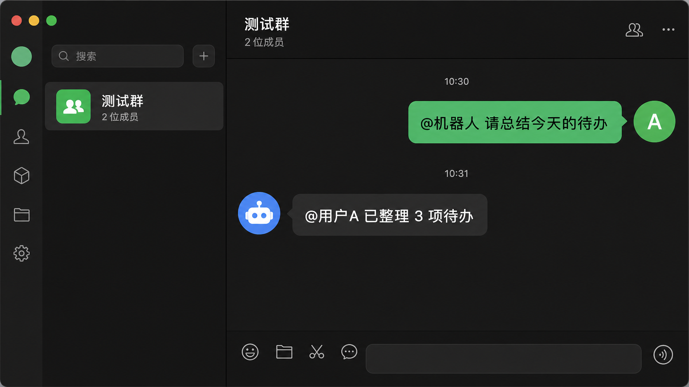
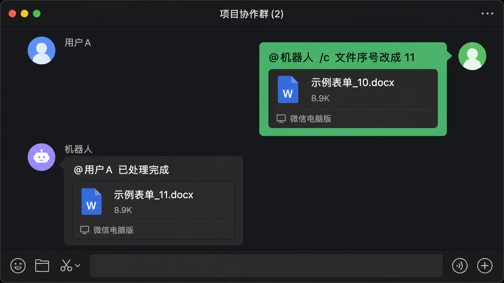

# wx4py

一个面向 **macOS 微信 4.x** 的微信群 AI 接入项目。

它可以监听指定微信群里的 `[有人@我]` 提示，在被 @ 时调用 OpenAI-compatible 大模型自动回复；也可以把带前缀的消息转给本地 OpenClaw agent，让微信群拥有处理文件、执行任务和长链路工具调用的能力。

如果你想把微信群变成一个轻量的 AI 工作入口，又不想改微信、不想写浏览器插件、不想维护一套复杂 bot 网关，wx4py 就是为这个场景准备的。

> 当前版本只支持 macOS 微信 4.x，不承诺 Windows 支持。项目仍处于 Alpha 阶段，欢迎 Star、Issue 和 PR。



## 本项目实现的功能

### 1. 群聊 @ AI 自动回复

- 只监听配置文件中的群聊白名单，避免误处理其他群。
- 只在群消息 @ 当前登录微信昵称时触发，日常聊天不会调用模型。
- 支持 OpenAI-compatible API，例如火山引擎 Ark Bots、OpenAI 兼容服务等。
- 多群消息进入同一个串行队列，逐条生成、逐条切群发送，降低焦点抢占和串群风险。
- 按群隔离上下文，并从 `logs/group_mentions` 恢复最近对话，重启后仍保留短期记忆。
- 自动回复前支持随机延迟，让回复节奏更接近真人聊天。

典型效果：

```text
用户：@机器人 帮我总结一下今天测试环境要重点关注什么？
机器人：@用户 可以先看三件事：服务健康状态、最近变更项、错误日志里是否有新增异常...
```

### 2. OpenClaw 双引擎模式

普通 @ 消息走 LLM 快速回复；带指定前缀的消息，例如 `/claw` 或 `/c`，会交给本地 OpenClaw agent 处理。

适合这些场景：

- 让 AI 在本地执行更复杂的任务。
- 让微信群消息触发工具调用、代码执行、文件处理等长链路能力。
- OpenClaw 调用失败时可自动降级到普通 LLM 回复，减少服务中断。
- 支持 `/new`、`/reset` 等指令重置当前群的 OpenClaw 会话。

### 3. 引用文件处理与自动回传

当群成员引用微信文件卡片并 @ 机器人使用 OpenClaw 前缀时，wx4py 会尽量解析引用气泡中的附件，定位或下载文件，把文件路径传给 OpenClaw，并在处理完成后把生成文件自动发回微信群。



示例：

```text
用户：引用「示例表单_10.docx」并发送：@机器人 /c 文件名称序号改成 11 发给我
机器人：@用户 已改成 11 了，文件路径：/Users/.../.wx4py_files/示例表单_11.docx
机器人：发送文件「示例表单_11.docx」
```

### 4. 日志与排查能力

- `wx4py.log`：项目运行日志。
- `logs/group_mentions/YYYY-MM-DD/群名.log`：按群、按天记录 @ 消息、模型回复和发送结果。
- `logs/errors/YYYY-MM-DD.log`：记录 AI 调用异常、切群失败、发送失败、发送后不可见等关键错误。

这些日志既方便排查，也会用于启动时恢复同群上下文。

## 存在的不足

wx4py 基于 macOS Accessibility 操作微信原生客户端，优势是接入轻、无需改微信；代价是它必须依赖当前微信窗口状态。

- 微信必须已登录，主窗口需要保持打开，建议不要最小化。
- 运行期间尽量不要手动操作微信，尤其不要切群、点击聊天区、输入文字、拖拽文件或打开独立聊天窗口，否则可能抢走焦点。
- 发送消息、下载文件、读取引用气泡时，脚本会激活微信并操作前台窗口。
- 如果微信出现登录页、弹窗、辅助功能控件树异常或窗口焦点被其他软件抢占，可能导致读取失败或发送失败。
- 普通文本回复最稳定；文件处理依赖微信 macOS 当前 UI、文件下载状态和 OpenClaw workspace，稳定性会弱一些。
- 不建议用于高频营销、骚扰、刷屏或任何违反微信规则的场景。

一句话：它适合做“有人 @ 我时的 AI 助手”，不适合做完全无人值守、高并发、强 SLA 的企业消息网关。

## 接入步骤

### 1. 准备环境

需要：

- macOS 12 或更高版本。
- Python 3.9 或更高版本。
- 微信 macOS 4.x，已登录。
- 给运行脚本的终端、Python 解释器或 OpenClaw 授予「系统设置 -> 隐私与安全性 -> 辅助功能」权限。

安装依赖：

```bash
git clone https://github.com/claw-codes/wx4py.git
cd wx4py
python3 -m pip install -r requirements.txt
python3 -m pip install -e .
```

可选：确认核心模块能正常导入。

```bash
python3 - <<'PY'
from src import WeChatClient, AIClient, AIConfig, AIResponder
print("wx4py ok")
PY
```

### 2. 复制配置模板

```bash
cp wx4py_ai_config.example.json wx4py_ai_config.json
```

`wx4py_ai_config.json` 已在 `.gitignore` 中，不会提交你的 API Key。

### 3. 编辑配置

最小配置只需要关注这些字段：

```json
{
  "groups": ["交个朋友"],
  "reply_delay_range": [5, 18],
  "ai_context_size": 8,
  "ai_max_reply_chars": 180,
  "default": "ark",
  "providers": {
    "ark": {
      "base_url": "https://ark.cn-beijing.volces.com/api/v3/bots",
      "api_format": "completions",
      "model": "bot-xxxxxxxx",
      "api_key": "replace-with-your-api-key",
      "temperature": 0.7,
      "max_tokens": 220,
      "timeout": 20
    }
  }
}
```

关键字段说明：

- `groups`：监听群聊白名单。必须和微信左侧会话列表里的群名一致。
- `reply_delay_range`：回复前随机等待秒数范围。
- `ai_context_size`：同一个群带给模型的最近上下文条数。
- `ai_max_reply_chars`：单条回复目标长度，建议控制在 80-220。
- `default`：默认使用 `providers` 中的哪一个服务。
- `providers`：OpenAI-compatible 模型服务配置。

也可以直接运行启动脚本，它会打开本地 Web 配置界面，保存后再启动机器人。

### 4. 启动机器人

```bash
python3 run_ai_group_bot.py
```

启动后会显示配置文件、监听群聊、回复延迟、上下文长度、日志目录和当前引擎模式。按 `Ctrl+C` 停止。

运行时请保持微信主窗口打开。然后在配置的群里发送：

```text
@你的微信昵称 帮我写一条简短的欢迎语
```

如果模型配置正确，机器人会等待随机延迟后自动回复。

### 5. 可选：启用 OpenClaw

在 `wx4py_ai_config.json` 中打开 `openclaw`：

```json
{
  "openclaw": {
    "enabled": true,
    "mode": "hybrid",
    "agent_id": "main",
    "prefixes": ["/c", "/claw"],
    "timeout": 60,
    "fallback_to_llm": true,
    "session_per_group": true,
    "cli_path": "/Users/xxx/.nvm/versions/node/v22.22.1/bin/openclaw",
    "file_support": true,
    "reset_commands": ["/new", "/reset"]
  }
}
```

推荐使用 `hybrid` 模式：普通 @ 消息走 LLM，带 `/c` 或 `/claw` 的消息走 OpenClaw。

如需处理微信文件，还可以开启 `file_monitor`，让程序更容易发现已下载文件的真实路径：

```json
{
  "file_monitor": {
    "enabled": true,
    "watch_dirs": [],
    "poll_interval": 5,
    "max_age_seconds": 600,
    "auto_discover": true
  }
}
```

## 推荐验证

第一次接入建议按这个顺序验证：

1. 启动 `python3 run_ai_group_bot.py`，确认当前登录微信昵称识别正确。
2. 在配置群里 @ 当前昵称，确认模型生成回复并发送。
3. 连续 @ 两条消息，确认回复按队列顺序发送。
4. 多个群轮流 @，确认回复没有串群。
5. 重启脚本后询问“刚才问的什么”，确认能从群日志恢复上下文。
6. 填错 API Key 或断网一次，确认 `logs/errors/YYYY-MM-DD.log` 有错误记录。
7. 如果启用了 OpenClaw，发送 `@机器人 /c 你好`，确认前缀消息进入 OpenClaw。
8. 如果启用了文件处理，引用一个 docx 文件并发送 `@机器人 /c 文件名称序号改成 12 发给我`，确认最终回传的是新生成文件。

## 代码接入

大多数用户推荐直接使用 `run_ai_group_bot.py`。如果要嵌入自己的程序，可以使用核心 API：

```python
from src import AIClient, AIConfig, AIResponder, AsyncCallbackHandler, WeChatClient

groups = ["交个朋友"]
ai = AIClient(AIConfig.from_file("wx4py_ai_config.json"))
responder = AIResponder(ai, context_size=8, reply_on_at=True, max_reply_chars=180)

with WeChatClient(auto_connect=True) as wx:
    wx.process_groups(
        groups,
        [AsyncCallbackHandler(responder, auto_reply=True, reply_on_at=True)],
        reply_delay_range=(2, 5),
        block=True,
    )
```

## 使用建议

- 监听群尽量从 1-3 个开始，确认稳定后再逐步增加。
- 回复长度建议短一些，越像正常微信聊天越自然。
- OpenClaw 任务建议使用明确前缀，例如 `/c`，避免普通闲聊误触发长任务。
- 文件任务最好直接引用微信文件卡片，不要只说“这个文件”，否则机器人很难可靠判断目标文件。
- OpenClaw 生成的文件不要在机器人发送前移动或删除。
- 如果遇到文件处理异常，优先查看 `wx4py.log`，里面会记录引用气泡、附件候选、OpenClaw 命令和文件发送结果。

## 精简更新日志

- **2026-05-06**：完善 OpenClaw 文件引用与回传链路。支持解析微信引用文件、传给 OpenClaw、识别生成文件并自动发送；修复旧附件误继承、输入文件被误发、中文标点后文件名无法解析等问题。
- **2026-05-03**：新增 OpenClaw 双引擎模式。普通 @ 消息走 LLM，带 `/claw` 等前缀的消息走本地 OpenClaw agent；新增引用消息识别、按群 session 隔离、失败降级和切群稳定性优化。
- **2026-05-02**：项目主线调整为 macOS-only 微信群 @ AI 自动回复机器人。移除 Windows 后端，新增左侧会话列表监听、串行回复队列、按群上下文、审计日志和关键错误日志。

完整变更见 [docs/guide/CHANGELOG.md](docs/guide/CHANGELOG.md)。

## 贡献与支持

如果这个项目帮你把微信群接上了 AI，欢迎点一个 Star。它会让更多需要“微信原生客户端 + AI 助手”的开发者更容易找到这里。

也欢迎提交：

- macOS 微信不同版本的兼容性反馈。
- OpenAI-compatible 服务接入示例。
- OpenClaw 文件处理场景的复现和改进建议。
- 更稳定的 Accessibility 控件识别逻辑。

## 许可证与致谢

本项目沿用 AGPL-3.0-or-later 许可证。

感谢 [claw-codes/wx4py](https://github.com/claw-codes/wx4py) 原项目提供灵感、命名和早期自动化思路；当前仓库的 macOS-only 机器人改造不代表原项目官方支持范围。
